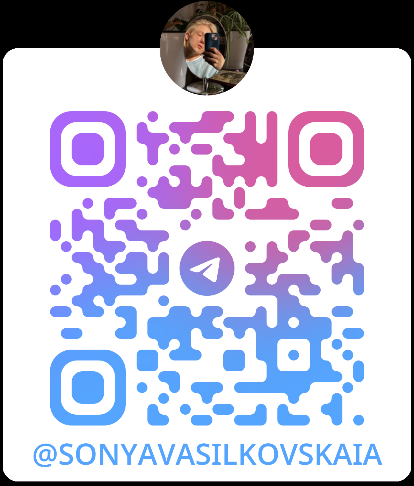

# Fakten über mich

## Меня зовут Соня и я:

- осваиваю Fullstack-разработку в Нетологии
- учусь в УрФУ на переводчика, владею немецким, испанским и корейским языками.
- рисую картины как на холстах, так и в digital 
- 15 лет занимаюсь плаванием

Cвязаться со мной можно в телеграме
 